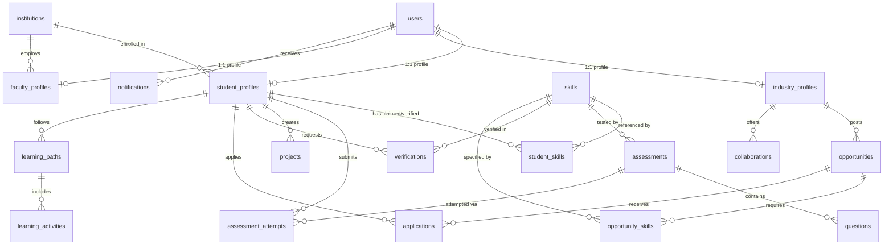

# SKILLSETU: Database Documentation
## Problem Statement: SIH26044
**SQLite Relational Data Architecture & Schema Reference**

---

## 1. Database Overview

* **Engine**: SQLite 3 (Driver: `better-sqlite3` native C++ bindings for Node.js).
* **Storage Path**: `database/sih_portal.sqlite` (relative to project root).
* **Connection Manager**: `backend/database/db.js`.
* **Schema Definition**: `backend/database/schema.sql`.
* **Seed Script**: `backend/database/seed.js`.
* **Integrity Constraints**: `PRAGMA foreign_keys = ON` enforced on every connection.
* **ACID Transactions**: Wrapped using `db.transaction()` for atomic multi-table mutations (e.g. user registration + profile insertion).

---

## 2. Entity-Relationship Model



---

## 3. Detailed Table Dictionary

### 1. `users`
Core authentication table containing all platform actors.
* `id` (TEXT, PK): Unique user identifier (`usr-stu-01`, `usr-ind-01`, etc.).
* `email` (TEXT, UNIQUE, NOT NULL): Login email (supports both demo `@demo.sih` and standard formats).
* `password_hash` (TEXT, NOT NULL): Salted bcrypt hash (`$2a$10$...`).
* `role` (TEXT, NOT NULL): One of `'STUDENT'`, `'INDUSTRY'`, `'FACULTY'`, `'INSTITUTION_ADMIN'`.
* `name` (TEXT, NOT NULL): Full legal or official name.
* `avatar` (TEXT): HTTPS image URL.
* `created_at` (DATETIME): Timestamp.

### 2. `institutions`
Participating universities and colleges.
* `id` (TEXT, PK): E.g. `inst-01`.
* `name` (TEXT, NOT NULL): E.g. "National Institute of Technology, Trichy".
* `code` (TEXT, UNIQUE): E.g. `NIT-TRICHY`.
* `state`, `city`, `type` (TEXT).

### 3. `student_profiles`
Extended academic credentials for student users.
* `id` (TEXT, PK): E.g. `stu-01`.
* `user_id` (TEXT, UNIQUE, FK -> users.id): Cascades on user deletion.
* `name`, `email`, `phone` (TEXT).
* `branch` (TEXT, NOT NULL): `'ECE'`, `'CSE'`, `'EEE'`, `'Mechanical'`, or `'Civil'`.
* `year` (TEXT, NOT NULL): `'1st Year'`, `'2nd Year'`, `'3rd Year'`, or `'4th Year'`.
* `institution_name` (TEXT, NOT NULL).
* `career_goal` (TEXT, NOT NULL): E.g. "Embedded Systems Engineer".
* `cgpa` (REAL): Cumulative Grade Point Average (0.0 to 10.0).
* `readiness_score` (INTEGER): Dynamic readiness index (0 to 100).
* `verified_skills_count`, `pending_skills_count` (INTEGER).
* `portfolio_slug` (TEXT, UNIQUE): URL slug for the public digital portfolio.

### 4. `industry_profiles`
Corporate and recruiting partner organizations.
* `id` (TEXT, PK): E.g. `comp-1`.
* `user_id` (TEXT, UNIQUE, FK -> users.id).
* `company_name` (TEXT, NOT NULL): E.g. "Bosch Engineering & Mobility".
* `industry_sector` (TEXT, NOT NULL): E.g. "Automotive Embedded & IoT".
* `website`, `location`, `description` (TEXT).
* `verified_partner` (INTEGER, DEFAULT 1): Flag indicating verified partner.

### 5. `faculty_profiles`
Academic mentors and department heads.
* `id` (TEXT, PK).
* `user_id` (TEXT, UNIQUE, FK -> users.id).
* `name`, `department`, `designation`, `institution_name`, `email`, `phone` (TEXT).

### 6. `skills`
Master catalog of engineering competencies across disciplines.
* `id` (TEXT, PK): E.g. `sk-01`.
* `name` (TEXT, UNIQUE, NOT NULL): E.g. "Embedded C", "RTOS (FreeRTOS)", "Python & PyTorch".
* `category` (TEXT, NOT NULL): Core Technical, Tools, Frameworks, Systems, Domain.
* `discipline` (TEXT, NOT NULL): `'ECE'`, `'CSE'`, `'EEE'`, `'Mechanical'`, `'Civil'`, or `'Cross-Discipline'`.
* `description` (TEXT).

### 7. `student_skills`
Cross-table tracking student claims, assessment results, and verification statuses.
* `id` (TEXT, PK).
* `student_id` (TEXT, FK -> student_profiles.id).
* `skill_id` (TEXT, FK -> skills.id).
* `claimed_level` (INTEGER, 1 to 5).
* `assessment_level` (INTEGER, 0 to 5).
* `evidence_level` (INTEGER, 0 to 5).
* `verified_level` (INTEGER, 0 to 5).
* `verification_status` (TEXT): `'NOT_VERIFIED'`, `'IN_REVIEW'`, `'VERIFIED'`, `'REJECTED'`.
* `confidence_level` (TEXT): `'NONE'`, `'LOW'`, `'MEDIUM'`, `'HIGH'`.
* `last_assessed_at` (DATETIME).

### 8. `assessments` & `questions`
Deterministic technical tests.
* `assessments`: `id`, `skill_id`, `skill_name`, `title`, `time_limit_mins`, `passing_score`, `difficulty_level`.
* `questions`: `id`, `assessment_id`, `question_text`, `question_type` (`'MCQ'`, `'CODE'`, `'PRACTICAL'`), `option_a`, `option_b`, `option_c`, `option_d`, `correct_option`, `explanation`, `code_snippet`.

### 9. `verifications`
Audit trail of practical tasks and viva explanations submitted by students.
* `id` (TEXT, PK).
* `student_id` (TEXT, FK -> student_profiles.id).
* `skill_id` (TEXT, FK -> skills.id).
* `practical_task_title`, `practical_task_desc` (TEXT).
* `submission_notes`, `explanation_text`, `modification_task_response` (TEXT).
* `assessment_score`, `project_evidence_score`, `practical_score` (REAL).
* `consistency_rating` (TEXT): `'LOW'`, `'MEDIUM'`, `'HIGH'`.
* `final_verdict` (TEXT): `'PENDING'`, `'VERIFIED'`, `'NEEDS_REVIEW'`, `'REJECTED'`.
* `reviewer_name`, `reviewer_comments`, `verified_at` (DATETIME).

### 10. `opportunities` & `opportunity_skills`
Internships and placement job postings.
* `opportunities`: `id`, `company_id`, `company_name`, `title`, `opportunity_type` (`'INTERNSHIP'`, `'FULL_TIME'`), `branch`, `description`, `location`, `mode` (`'ON_SITE'`, `'HYBRID'`, `'REMOTE'`), `duration`, `stipend`, `status` (`'OPEN'`, `'CLOSED'`).
* `opportunity_skills`: `id`, `opportunity_id`, `skill_id`, `min_level` (1-5), `weight` (REAL).

### 11. `applications`
Student applications to opportunities.
* `id` (TEXT, PK).
* `student_id` (TEXT, FK -> student_profiles.id).
* `opportunity_id` (TEXT, FK -> opportunities.id).
* `match_score` (INTEGER): Calculated 60-20-10-10 score (0 to 100).
* `status` (TEXT): `'APPLIED'`, `'UNDER_REVIEW'`, `'SHORTLISTED'`, `'INTERVIEW'`, `'SELECTED'`, `'REJECTED'`.
* `notes`, `applied_at`, `updated_at`.

### 12. `learning_paths` & `learning_activities`
Personalized sprint curriculums generated to close skill gaps.
* `learning_paths`: `id`, `student_id`, `title`, `target_readiness`, `completed_modules`, `total_modules`.
* `learning_activities`: `id`, `learning_path_id`, `week_number`, `title`, `description`, `resource_url`, `is_completed`.

### 13. `collaborations`
Industry-Academia MoUs and sponsored programs.
* `id` (TEXT, PK).
* `industry_id` (TEXT, FK -> industry_profiles.id).
* `company_name`, `title`, `type` (`'WORKSHOP'`, `'GUEST_LECTURE'`, `'LIVE_PROJECT'`, `'FDP'`), `discipline`, `status` (`'PROPOSED'`, `'REQUESTED'`, `'ACCEPTED'`, `'ACTIVE'`).
* `faculty_name`, `institution_name`.

### 14. `notifications`
Database-backed notifications for student, faculty, and industry events.
* `id` (TEXT, PK).
* `user_id` (TEXT, FK -> users.id).
* `title`, `message`, `type`, `is_read` (INTEGER 0/1).

---

## 4. How Key Workflows Mutate the Database

### A. New User Registration
```sql
BEGIN TRANSACTION;
INSERT INTO users (id, email, password_hash, role, name, avatar)
VALUES ('usr-101', 'student.new@institute.edu', '$2a$10$...', 'STUDENT', 'Rohan Das', '...');

INSERT INTO student_profiles (id, user_id, name, email, branch, year, institution_name, career_goal, readiness_score)
VALUES ('stu-101', 'usr-101', 'Rohan Das', 'student.new@institute.edu', 'CSE', '3rd Year', 'NIT Delhi', 'Cloud & AI Engineer', 40);

INSERT INTO notifications (id, user_id, title, message, type)
VALUES ('notif-101', 'usr-101', 'Welcome to SKILLSETU', 'Your student account is active.', 'SYSTEM');
COMMIT;
```

### B. Taking an Assessment & Verifying a Skill
```sql
BEGIN TRANSACTION;
INSERT INTO assessment_attempts (id, student_id, assessment_id, skill_id, score, max_score, percentage, passed)
VALUES ('att-1', 'stu-01', 'as-rtos', 'sk-rtos', 92, 100, 92.0, 1);

INSERT OR REPLACE INTO student_skills (id, student_id, skill_id, assessment_level, verified_level, verification_status, confidence_level)
VALUES ('ss-1', 'stu-01', 'sk-rtos', 4, 4, 'VERIFIED', 'HIGH');

UPDATE student_profiles SET readiness_score = 84, verified_skills_count = verified_skills_count + 1 WHERE id = 'stu-01';
COMMIT;
```

### C. Applying to an Internship Opportunity
```sql
INSERT INTO applications (id, student_id, opportunity_id, match_score, status)
VALUES ('app-1', 'stu-01', 'job-1', 89, 'APPLIED');

UPDATE opportunities SET applicantsCount = applicantsCount + 1 WHERE id = 'job-1';
```

---

## 5. Database Performance & Scaling to Production
* **Current Prototype**: Local SQLite database handles tens of thousands of queries per second with zero network latency.
* **Production Scaling**: The schema is strictly ANSI SQL compliant. Migrating to PostgreSQL requires only replacing the `better-sqlite3` driver with `pg` / `knex` / `Prisma` with zero schema redesign.
