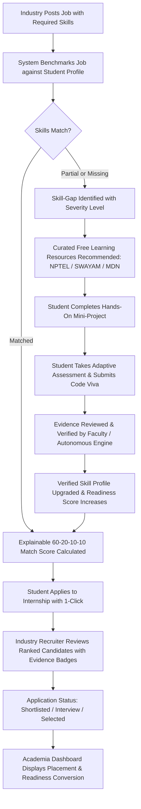

# SKILLSETU: National Portal for Academia–Industry Collaboration
## Problem Statement: SIH26044
**Skill Mapping, Evidence-Based Verification, Free Learning Pathways, and Transparent Internship/Placement Matching**

---

## 1. Project Overview

### What is SIH26044?
**SIH26044** is a Smart India Hackathon 2026 problem statement titled:
> *"Portal for Academia–Industry Collaboration for Skill Mapping, Internships and Placement"*

In India's higher education system, there is a systemic mismatch between what colleges teach and what modern engineering industries actively recruit for. Traditional recruitment relies on self-declared resumes that often contain inflated claims. Meanwhile, academic departments struggle to see real-time skill gaps in their cohorts, and students lack a guided path to bridge those gaps using free, high-quality resources.

**SKILLSETU** resolves this challenge by establishing an active three-way bridge:
$$\text{Students} \longleftrightarrow \text{Academia (Faculty \& Depts)} \longleftrightarrow \text{Industry (Recruiters \& Employers)}$$

### What Problem Does This Portal Solve?
1. **Unreliable Self-Declared Resumes**: Students claim skills on paper that they cannot demonstrate in practice. Recruiters spend hundreds of hours filtering candidates.
2. **Delayed Skill Gap Awareness**: Students only discover their skill deficiencies during final-year placement interviews when it is too late to course-correct.
3. **Curriculum Disconnect**: Academia updates course syllabi once every few years, while industry tooling and engineering frameworks evolve every quarter.
4. **Lack of Transparent Matching**: Commercial job boards use opaque "AI black-box" match percentages with zero auditability or rationale.
5. **Inequity in Quality Learning**: High-cost private certification courses exclude underprivileged students. High-quality national initiatives like **NPTEL** and **SWAYAM** remain underutilized because they are not connected directly to active job openings.

### Who Uses the System?
* **Students**: Across engineering disciplines (ECE, CSE, EEE, Mechanical, Civil) to benchmark their skills, take deterministic assessments, verify practical evidence, identify gaps, follow curated free roadmaps, and apply to matched opportunities.
* **Industry Recruiters**: To post technical internships and jobs with weighted competency requirements, discover ranked candidates with evidence badges, audit applicant viva explanations, and collaborate with institutions.
* **Faculty & Academia**: To monitor cohort-wide skill gaps in real time, review and verify student practical tasks, assign department assessments, and partner with industries for sponsored labs and workshops.
* **Institutional Administrators (Dean / Placement Cells)**: To inspect macro skill demand trends across branches, measure placement conversion rates, and manage institutional MoUs.

---

## 2. Why SKILLSETU is Different from a Normal Job Portal

| Feature | Standard Job Board (LinkedIn / Naukri) | SKILLSETU (SIH26044 Portal) |
| :--- | :--- | :--- |
| **Skill Trust** | 100% unverified self-declaration. | **Evidence-based multi-factor verification** (MCQ + Practical Task + Code Viva + Hardware/Git Evidence). |
| **Matching Engine** | Opaque black-box percentage. | **Transparent 60-20-10-10 explainable scoring** (60% Verified Skills, 20% Assessments, 10% Projects, 10% Coursework). |
| **When Gaps Occur** | Rejection email with zero feedback. | **Automated Skill-Gap Engine** generating a 4-week learning sprint. |
| **Learning Resources** | Commercial course ads with high fees. | Curated **Free Learning Providers** (NPTEL, SWAYAM, MDN, Microsoft Learn, Cisco) with transparent exam fee notices. |
| **Role of Colleges** | Colleges are completely bypassed. | **Active Academia Portal** where faculty review evidence and monitor cohort readiness. |
| **Industry MoUs** | No institutional collaboration. | **Marketplace for Industry-Academia MoUs**, sponsored equipment, and guest workshops. |

---

## 3. Complete End-to-End Workflow



---

## 4. Technology Stack & Rationale

### Frontend
* **React 18**: Component-based user interface enabling responsive rendering across student, academia, industry, and admin portals.
* **TypeScript 5**: Complete compile-time type safety preventing runtime null pointer exceptions across complex data structures (assessments, skill breakdowns, applications).
* **Vite 6**: Ultra-fast next-generation frontend build tooling and Hot Module Replacement (HMR) with sub-450KB production bundle size.
* **Tailwind CSS 3**: Utility-first responsive dark theme (`#090d16` base) designed for engineering data density and readability without unnecessary clutter.
* **Lucide React**: Clean, modern iconography for engineering disciplines, skill statuses, and verification badges.
* **Canvas Confetti**: Visual celebration reward when students pass skill assessments and earn verified badges.

### Backend
* **Node.js (v18 - v24 compatible)**: Event-driven asynchronous JavaScript runtime running natively on any student laptop.
* **Express.js**: Lightweight REST API framework providing clean routing for auth, students, opportunities, verifications, and analytics.
* **CORS**: Cross-Origin Resource Sharing middleware enabling seamless frontend-backend communication.
* **JSON Web Tokens (JWT)**: Stateless token-based session persistence with 7-day expiration.
* **Bcryptjs**: Robust salted password hashing for prototype user security.

### Database
* **SQLite (`better-sqlite3`)**: 
  - Zero-configuration, zero-cost, self-contained relational database.
  - No external cloud services or database servers required to run.
  - Supports strict schema constraints, foreign key cascades, and ACID transactions.
  - Easily migratable to PostgreSQL or MySQL for production deployment.

### Why No Paid AI Services Were Used
To guarantee **100% offline hackathon reliability**, the system uses deterministic algorithms:
- Resume skill extraction uses keyword/regex heuristics across disciplines.
- Skill matching uses an auditable mathematical formula ($60\% + 20\% + 10\% + 10\%$).
- Anti-fraud verification uses objective consistency checks between MCQ answers and viva explanations.
- Zero reliance on paid OpenAI/Anthropic APIs ensures zero latency, zero quota exhaustion, and zero cost for students.

---

## 5. System Architecture

```
+-------------------------------------------------------------------------+
|                              USER BROWSER                                |
|  (Student Portal / Industry Portal / Faculty Portal / Admin Dashboard)   |
+-------------------------------------------------------------------------+
                                    |
                           HTTP / REST API (Port 5173 -> Proxied)
                                    v
+-------------------------------------------------------------------------+
|                        EXPRESS.JS BACKEND (Port 5000)                   |
|                                                                         |
|  +------------------+  +-------------------+  +----------------------+  |
|  |   Auth Routes    |  |  Student Routes   |  | Opportunity Routes   |  |
|  +------------------+  +-------------------+  +----------------------+  |
|  +------------------+  +-------------------+  +----------------------+  |
|  | Verifications    |  |  Assessments      |  | Collaborations       |  |
|  +------------------+  +-------------------+  +----------------------+  |
|                                                                         |
|  Services: MatchingEngine | SkillGapEngine | VerificationEngine         |
+-------------------------------------------------------------------------+
                                    |
                           better-sqlite3 Driver
                                    v
+-------------------------------------------------------------------------+
|                    SQLITE DATABASE: sih_portal.sqlite                   |
|  (22 Tables: users, student_profiles, skills, assessments, verifications,|
|   opportunities, applications, learning_paths, collaborations, etc.)    |
+-------------------------------------------------------------------------+
```

---

## 6. Folder Structure & Directory Guide

```
SIH (Copy)/
├── backend/                        # Node.js + Express REST API Backend
│   ├── database/                   # SQLite schema, db connection & seed scripts
│   │   ├── db.js                   # better-sqlite3 connection manager
│   │   ├── schema.sql              # Relational SQL schema definitions (22 tables)
│   │   └── seed.js                 # Seed script with realistic multi-branch demo data
│   ├── middleware/                 # JWT Authentication & Role Authorization middleware
│   ├── routes/                     # REST API Route Controllers
│   │   ├── auth.js                 # Login, Registration, Demo-Switch, Forgot-Password
│   │   ├── students.js             # Student dashboard, profile, roadmap, resume parse
│   │   ├── assessments.js          # MCQs, practical tests, score calculation
│   │   ├── verifications.js        # Multi-stage evidence verification & faculty review
│   │   ├── opportunities.js        # Internships/jobs, 60-20-10-10 matching, apply
│   │   ├── industry.js             # Recruiter dashboard, candidate ranking, status update
│   │   ├── faculty.js              # Academia dashboard, student roster, gap tracker
│   │   ├── admin.js                # Institution demand & placement analytics
│   │   ├── collaborations.js       # Industry-Academia MoUs & sponsored labs
│   │   └── notifications.js        # In-app notifications
│   ├── services/                   # Core business logic engines
│   │   ├── matchingEngine.js       # 60-20-10-10 Transparent matching algorithm
│   │   ├── skillGapEngine.js       # Target role gap identification & roadmap generator
│   │   ├── verificationEngine.js   # Multi-factor anti-fraud consistency check
│   │   └── resumeParser.js         # Local NLP heuristic skill extraction
│   └── server.js                   # Express server entry point (Port 5000)
│
├── database/                       # Persistent SQLite database storage
│   └── sih_portal.sqlite           # SQLite database file containing pre-seeded data
│
├── src/                            # React + TypeScript Frontend Application
│   ├── components/                 # Organized UI component modules
│   │   ├── common/                 # Reusable components
│   │   │   ├── AuthModal.tsx       # Sign In & Register Modal with demo quick-fill
│   │   │   ├── Header.tsx          # Top navigation bar with notifications & user profile
│   │   │   ├── Sidebar.tsx         # Role-specific vertical navigation menu
│   │   │   ├── DemoSwitcherBar.tsx # Instant 1-click demo switcher & judge walkthrough guide
│   │   │   ├── AIResumeParserModal.tsx # Simulated NLP resume extraction tool
│   │   │   ├── Badge.tsx           # Colored status & severity badge components
│   │   │   ├── ProgressBar.tsx     # Animated progress bar component
│   │   │   └── StatCard.tsx        # KPI metrics display card
│   │   ├── landing/                # Public presentation landing page
│   │   │   └── LandingPage.tsx     # Hero overview of 3-way bridge & demo launchers
│   │   ├── student/                # Student portal views
│   │   │   ├── StudentDashboard.tsx     # Readiness score, quick gaps, active applications
│   │   │   ├── StudentProfile.tsx       # Academic background, verified credentials, projects
│   │   │   ├── SkillVerificationEngine.tsx # 7-stage anti-fraud evidence audit trail
│   │   │   ├── SkillGapAnalysis.tsx     # Target benchmark comparison & free learning resources
│   │   │   ├── LearningRoadmap.tsx      # 4-week structured sprint curriculum
│   │   │   ├── SkillAssessment.tsx      # Interactive MCQs, code modification & viva
│   │   │   ├── InternshipMatching.tsx   # Explainable 60-20-10-10 job matching & 1-click apply
│   │   │   ├── DigitalPortfolio.tsx     # Cryptographically verifiable public profile
│   │   │   └── StudentOnboardingModal.tsx # New student diagnostic onboarding wizard
│   │   ├── industry/               # Industry recruiter portal views
│   │   │   ├── IndustryDashboard.tsx    # Candidate pipeline, active jobs, placement stats
│   │   │   ├── CandidateMatching.tsx    # Ranked candidates with match breakdown & viva review
│   │   │   ├── CreateJobModal.tsx       # Multi-discipline internship opening creator
│   │   │   └── IndustryCollaborationOffers.tsx # Sponsored labs, workshops & MoU offers
│   │   ├── academia/               # Faculty & Department portal views
│   │   │   ├── AcademiaDashboard.tsx    # Department enrollment, cohort readiness, MoUs
│   │   │   ├── AssessmentManager.tsx    # Department technical assessments creator
│   │   │   └── StudentGapTracker.tsx    # Cohort skill gap monitor across ECE/CSE/EEE/Mech/Civil
│   │   └── admin/                  # Institutional administration views
│   │       ├── InstitutionAdminDashboard.tsx # Macro demand trends, core branch placement rates
│   │       └── CollaborationHub.tsx     # Industry-Academia MoU approval marketplace
│   ├── context/
│   │   └── AppContext.tsx          # Central state manager, API synchronization & auth handler
│   ├── data/
│   │   └── mockData.ts             # Rich multi-discipline engineering mock dataset
│   ├── services/
│   │   └── api.ts                  # Type-safe API client communicating with backend
│   ├── types/
│   │   └── index.ts                # TypeScript data interfaces for all entities
│   ├── App.tsx                     # Top-level view orchestrator & route coordinator
│   └── main.tsx                    # React DOM root mounting
│
├── package.json                    # Project configuration, dependencies, and launch scripts
├── vite.config.ts                  # Vite build config with /api reverse proxy to port 5000
├── tsconfig.json                   # TypeScript compiler options
└── tailwind.config.js              # Tailwind styling definitions
```
