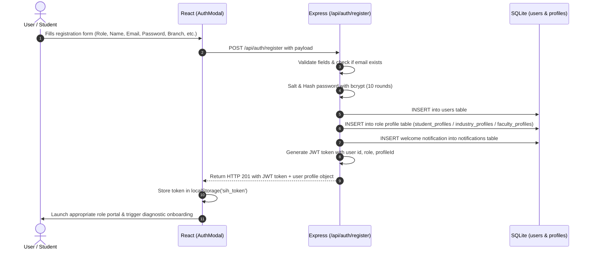
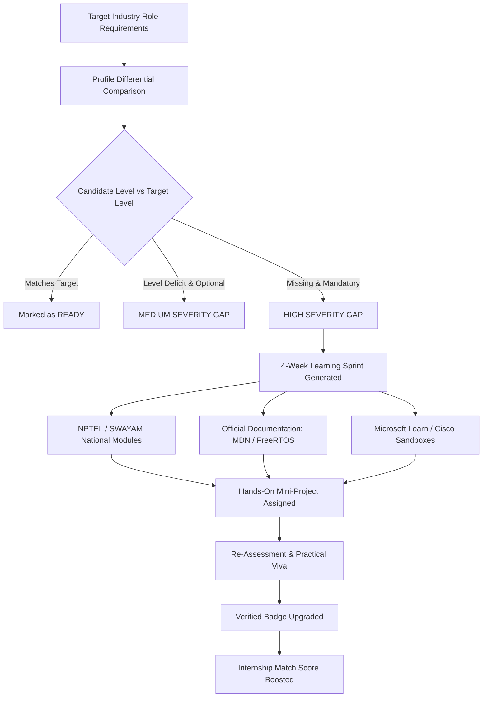
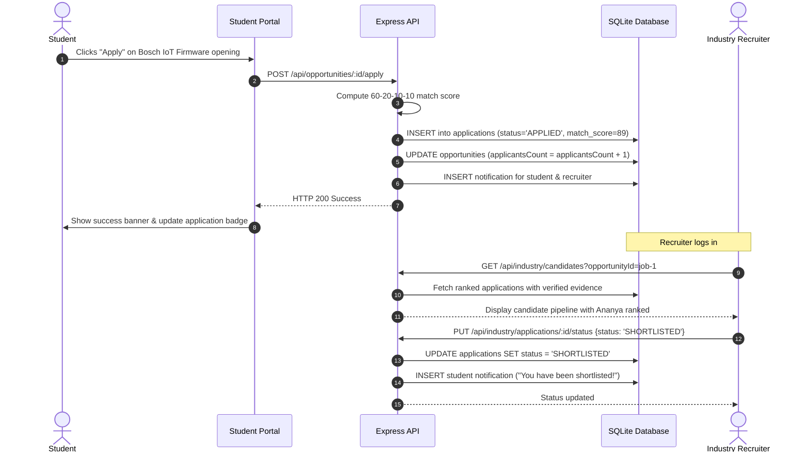

# SKILLSETU: Technical Architecture Manual
## Problem Statement: SIH26044

---

## 1. System High-Level Architecture

The system follows a modern decoupled Client-Server architecture designed for extreme lightweight local execution on consumer hardware while remaining architecturally ready for enterprise cloud scale.

```
+------------------------------------------------------------------------------------+
|                                    PRESENTATION LAYER                              |
|                          React 18 + TypeScript + Vite + Tailwind                   |
|                                                                                    |
|  [Student Portal]      [Industry Portal]      [Academia Portal]     [Admin Hub]    |
|   - Readiness Index     - Job Posting          - Cohort Gaps         - Macro Demand|
|   - 7-Stage Audit       - Candidate Ranking    - Evidence Review     - MoU Tracking|
|   - Roadmaps & Free Res - Status Updates       - Dept Assessments    - Analytics   |
+------------------------------------------------------------------------------------+
                                         |
                                         | HTTP / JSON over REST
                                         | Proxy: Vite (/api) -> Express (:5000)
                                         v
+------------------------------------------------------------------------------------+
|                                   APPLICATION LAYER                                |
|                                Node.js + Express.js Server                         |
|                                                                                    |
|  [Auth Middleware]     [Role Guard]           [Upload Handler]     [Error Catch]   |
|   - JWT Validation      - STUDENT, INDUSTRY,   - Multer media       - Unified JSON |
|   - Bcrypt Hashing        FACULTY, ADMIN         evidence buffer      responses    |
|                                                                                    |
|  ---------------------------- CORE COMPUTATION ENGINES ---------------------------  |
|                                                                                    |
|  +------------------------+  +------------------------+  +-----------------------+ |
|  |  Matching Engine       |  |  Skill-Gap Engine      |  |  Verification Engine  | |
|  |  60-20-10-10 Algorithm |  |  Severity & Free Sprints|  |  Multi-Factor Viva   | |
|  +------------------------+  +------------------------+  +-----------------------+ |
+------------------------------------------------------------------------------------+
                                         |
                                         | SQLite C-bindings (better-sqlite3)
                                         v
+------------------------------------------------------------------------------------+
|                                      DATA LAYER                                    |
|                        SQLite Database (database/sih_portal.sqlite)                |
|                                                                                    |
|  users • institutions • student_profiles • industry_profiles • faculty_profiles    |
|  skills • student_skills • assessments • questions • assessment_attempts           |
|  projects • verifications • career_roles • opportunities • opportunity_skills      |
|  applications • learning_paths • learning_activities • collaborations • notifs     |
+------------------------------------------------------------------------------------+
```

---

## 2. Authentication & Authorization Flow

### Dual Entry Model
The platform guarantees two symmetric ways to enter:
1. **Preloaded Demo Identities**: For rapid judge evaluation with pre-populated data.
2. **Real Account Registration**: For new users who want to register fresh credentials stored directly in the SQLite database.

Both approaches share the exact same database tables (`users`, `student_profiles`, `industry_profiles`, `faculty_profiles`), token generation, and authorization middleware.

### Registration Data Flow


### Role-Based Access Control (RBAC) Matrix

| Resource / Action | Student | Industry Partner | Faculty / Academia | Institution Admin |
| :--- | :---: | :---: | :---: | :---: |
| View Own Dashboard & Roadmap | **Yes** | No | No | No |
| Take Assessments & Submit Evidence | **Yes** | No | No | No |
| Apply to Jobs / Internships | **Yes** | No | No | No |
| Post Job / Internship Openings | No | **Yes** | No | No |
| View Applicant Pipeline & Update Status | No | **Yes** | No | No |
| Review Student Evidence & Issue Badges | No | No | **Yes** | **Yes** |
| Monitor Cohort Skill Gap Heatmap | No | No | **Yes** | **Yes** |
| Post Industry Collaboration MoUs | No | **Yes** | No | No |
| Request / Approve Collaboration MoUs | No | No | **Yes** | **Yes** |
| Macro Placement Analytics Across Branches| No | No | No | **Yes** |

---

## 3. The 60-20-10-10 Explainable Matching Engine

Traditional job boards display arbitrary match scores (e.g., "93% match") without explanation. SKILLSETU uses an auditable mathematical index where every percentage point is traceable.

$$\text{Overall Score} = S_{\text{skills}} (60\%) + A_{\text{assessment}} (20\%) + P_{\text{evidence}} (10\%) + E_{\text{coursework}} (10\%)$$

### 1. Skill Match Score ($S_{\text{skills}}$ — Max 60 Points)
Every job specifies a list of required competencies with:
* Required proficiency level ($L_{\text{req}} \in [1, 5]$)
* Importance weight ($W_i$, where $\sum W_i = 1.0$)
* Mandatory flag ($\text{isMustHave}$)

For each skill:
* **Fully Verified & Meets Level**: Candidate earns $100\%$ of $W_i$.
* **Verified but Lower Level**: Earns $W_i \times \frac{L_{\text{candidate}}}{L_{\text{req}}} \times 0.9$.
* **Unverified / Self-Declared**: Earns $W_i \times \frac{L_{\text{candidate}}}{L_{\text{req}}} \times 0.6$.
* **Missing Skill**: Earns $0\%$.

$$S_{\text{skills}} = 60 \times \frac{\sum \text{Earned Weight}}{\sum \text{Total Weight}}$$

### 2. Assessment Consistency Score ($A_{\text{assessment}}$ — Max 20 Points)
Calculated from the candidate's average score across relevant technical assessments:
$$A_{\text{assessment}} = 20 \times \frac{\text{Avg Assessment Score}}{100}$$

### 3. Project Evidence Score ($P_{\text{evidence}}$ — Max 10 Points)
Counts faculty-signed, practical repository demonstrations:
$$P_{\text{evidence}} = \min\left(10, \frac{\text{Verified Projects Count}}{2} \times 10\right)$$

### 4. Coursework & Credential Score ($E_{\text{coursework}}$ — Max 10 Points)
Recognizes validated university coursework and accredited NPTEL/SWAYAM certifications:
$$E_{\text{coursework}} = \text{Certified Credentials} \ge 1 \implies 10 \text{ pts} \quad (\text{otherwise } 8 \text{ pts})$$

---

## 4. The 7-Stage Anti-Fraud Skill Verification Engine

To solve the resume inflation crisis without relying on easily bypassed "AI text detectors," SKILLSETU uses an empirical multi-stage verification pipeline:

```
[ Stage 1: Self-Declaration ]
   Student declares skill & claimed level (1-5)
       │
       ▼
[ Stage 2: Deterministic Technical MCQ ]
   Timed randomized concept questions (Passing threshold >= 60%)
       │
       ▼
[ Stage 3: Repository / Hardware Demonstration ]
   Submission of verified GitHub repo, schematic, or simulation file
       │
       ▼
[ Stage 4: Live Practical Task ]
   Specific code modification task under time constraints
       │
       ▼
[ Stage 5: Oral / Written Concept Viva ]
   Student explains architectural rationale in their own words
       │
       ▼
[ Stage 6: Consistency Verification Check ]
   Compares MCQ score vs Practical score vs Viva explanation score.
   Variance <= 15% -> HIGH CONFIDENCE
   Variance > 15% -> FLAGGED FOR FACULTY REVIEW
       │
       ▼
[ Stage 7: Faculty Endorsement & Tamper-Evident Badge ]
   Department faculty signs off, upgrading skill to "VERIFIED" with permanent audit trail.
```

---

## 5. Automated Skill-Gap Engine & Free Learning Pathway

When a student evaluates their profile against a target career role (e.g. *Embedded Systems Engineer* or *AI/ML Engineer*), the Skill-Gap Engine computes:



### Free Learning Policy & Exam Transparency
The portal enforces complete honesty regarding educational costs:
* **NPTEL / SWAYAM**: Learning video access, course materials, and assignments are **100% Free of Cost**. Taking the optional proctored national examination for college transfer credits involves a nominal government fee ($\approx ₹1,000$).
* **Official Documentation (MDN, FreeRTOS, Linux Bootlin)**: **100% Free Open Source**.
* **Microsoft Learn & Cisco Skills For All**: **100% Free Interactive Modules & Sandboxes**.

---

## 6. End-to-End Application Workflow



---

## 7. Academia-Industry Collaboration Hub

The portal directly facilitates institutional partnerships:
1. **Industry posts Collaboration Offer**: E.g., Bosch offers sponsored STM32 CAN-FD Lab Kits and an automotive firmware workshop.
2. **Faculty / Admin discovers Offer**: Filters by discipline (ECE, CSE, etc.) and mode.
3. **Institutional Request submitted**: Faculty contact and expected student cohort size are submitted.
4. **MoU Approval**: Industry accepts the request, creating an active collaboration record in the database.
5. **Cohort Alignment**: Department curriculum is updated with the industry's recommended modules.
